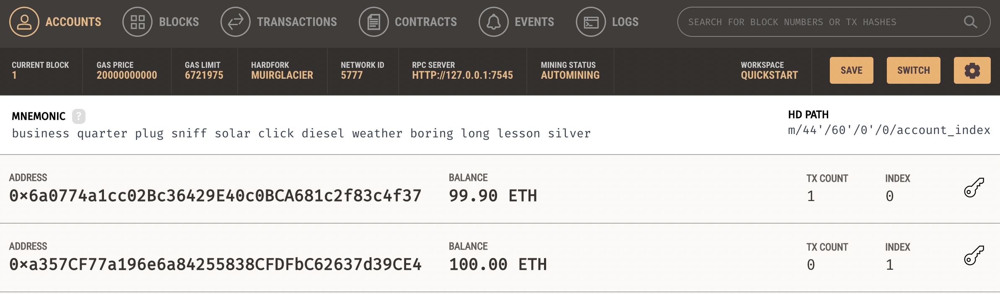
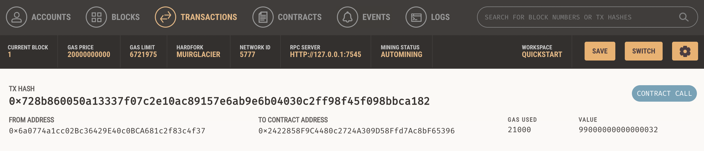

# Fintech_Finder
##Challenge 19

##Technologies
This application is written using Python 3.9.7 with the Streamlit library to create a shareable webpage interface for finding a fintech professional and pay them for their work using a digital wallet and the personal Ethereum blockchain Ganache.  A mnemonic seed phrase provided by Ganache is used to generate a new Ethereum account instance. A Fintech Finder candidate is selected as user input from a dropdown menu and the total value of the Ethereum transaction is calculated and compared to the account balance. The transaction to pay the candidate is digitally signed and executed by sending to the Ganache blockchain.  The transaction hash code is returned and inspected in Ganache 

## Installation Guide
Install the os, request and streamlit libraries, the Wallet module from bip44, Account, middleware and medium_gas_price_strategy modules from the Web3.py library, the dataclass function and data types from the typing module, and define a variable, w3, indicating the Ganache personal blockchain provider. 

## Usage
Run the streamlit webpage application with the command 'streamlit run fintech_finder.py'.

## Contributors
This program was written by David Hockenbery with the assistance of the UW FinTech class of 2021 and instructors. Contact David at dhockenb@gmail.com.

## License
Copyright (c) [2022] [David Hockenbery]

Permission is hereby granted, free of charge, to any person obtaining a copy
of this software and associated documentation files (the "Software"), to deal
in the Software without restriction, including without limitation the rights
to use, copy, modify, merge, publish, distribute, sublicense, and/or sell
copies of the Software, and to permit persons to whom the Software is
furnished to do so, subject to the following conditions:

The above copyright notice and this permission notice shall be included in all
copies or substantial portions of the Software.

THE SOFTWARE IS PROVIDED "AS IS", WITHOUT WARRANTY OF ANY KIND, EXPRESS OR
IMPLIED, INCLUDING BUT NOT LIMITED TO THE WARRANTIES OF MERCHANTABILITY,
FITNESS FOR A PARTICULAR PURPOSE AND NONINFRINGEMENT. IN NO EVENT SHALL THE
AUTHORS OR COPYRIGHT HOLDERS BE LIABLE FOR ANY CLAIM, DAMAGES OR OTHER
LIABILITY, WHETHER IN AN ACTION OF CONTRACT, TORT OR OTHERWISE, ARISING FROM,
OUT OF OR IN CONNECTION WITH THE SOFTWARE OR THE USE OR OTHER DEALINGS IN THE
SOFTWARE.